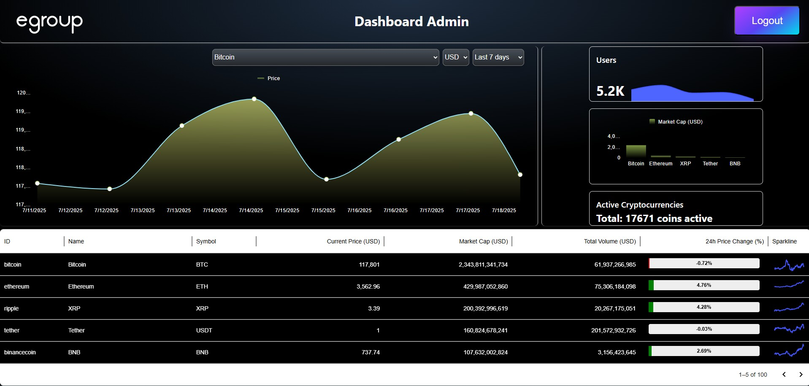
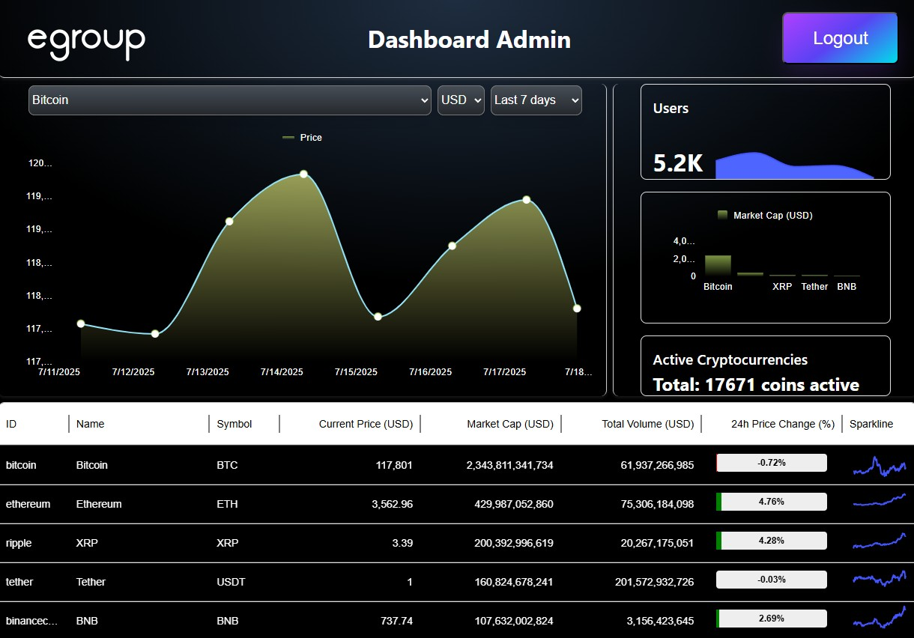
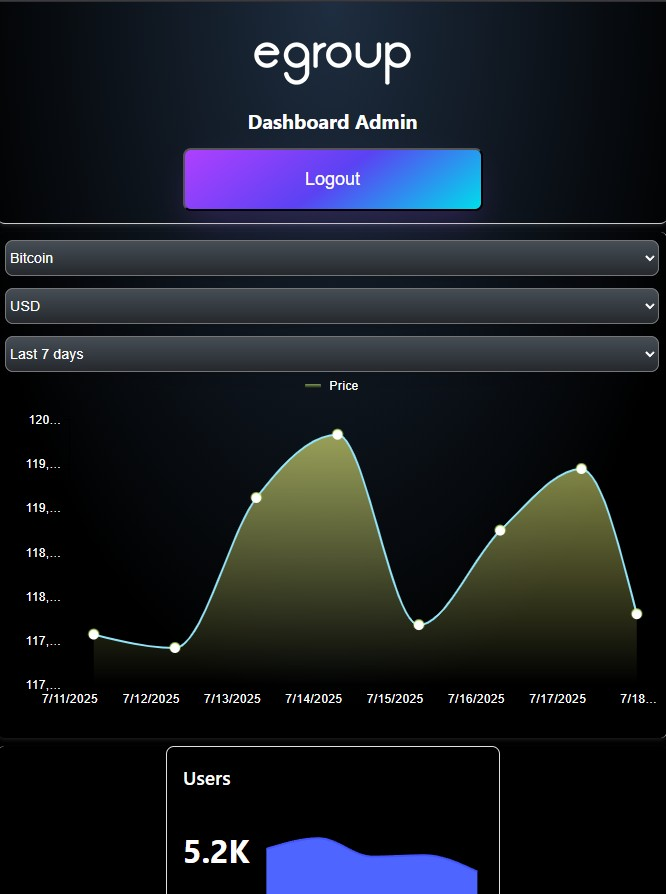
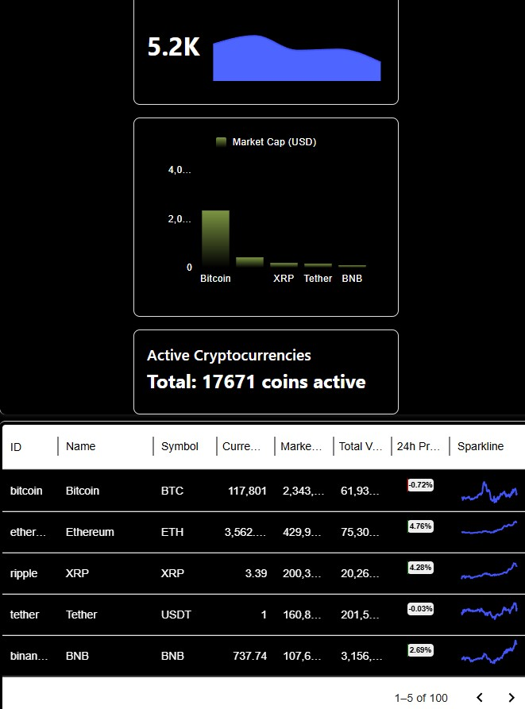

# 💰 Crypto Dashboard

Este proyecto es un **dashboard de criptomonedas** desarrollado con **React + Vite**. Consume datos en tiempo real del mercado cripto y los presenta en una interfaz responsiva, moderna y funcional en donde laa idea es cumplir la prueba  tecnica  y que el usuario pueda interactuar con ciertos datos.

## 🚀 Tecnologías

- [React](https://reactjs.org/)
- [Vite](https://vitejs.dev/)
- [MUI (Material UI)](https://mui.com/)
- [Chart.js / SparkLineChart](https://mui.com/x/react-charts/) (si aplican)
- API pública de criptomonedas 

---

## 📸 Vista previa

A continuación, algunos ejemplos visuales del dashboard en diferentes dispositivos:

### 🖥️ Desktop


### 📱 Tablet


### 📱 Mobile - Parte 1


### 📱 Mobile - Parte 2


---

## 📦 Instalación y ejecución local

### 1. Clona el repositorio

```bash
git clone https://github.com/Julian0399/EgroupDashboard.git
cd EgroupDashboard
cd dashboard
```

### 2. Instala las dependencias

```bash
npm install
# o
yarn install
```

### 3. Crea tu archivo de entorno

El proyecto requiere variables de entorno para conectarse a la API. Crea un archivo llamado `.env` en el root del proyect y agrega las claves:

```
VITE_CG_DEMO_API_URL=https://api.coingecko.com/api/v3
VITE_CG_DEMO_API_KEY=clave que sera adjunta en el correo o si tienen una pueden usarla
```

### 4. Ejecuta el servidor de desarrollo

```bash
npm run dev
# o
yarn dev
```

Abre [http://localhost:5173](http://localhost:5173) para ver el proyecto en el navegador.

---

## 🛠️ Scripts útiles

- `npm run dev` – Inicia el servidor de desarrollo
- `npm run build` – Genera la versión optimizada para producción
- `npm run preview` – Sirve localmente la versión producida

---

## 📁 Estructura del proyecto

```bash
src/
│
├── components/       # Componentes reutilizables
├── api/              # Lógica para llamadas a API
├── styles/           # Archivos CSS o módulos
└── main.jsx          # Punto de entrada
```
---

## 🌐 Demo en línea


🔗 https://egroup-dashboard.vercel.app/

---

## 🤝 Autor

Desarrollado por **Julian Rodriguez**

- [LinkedIn](https://www.linkedin.com/in/julianrod-ing/)

---

